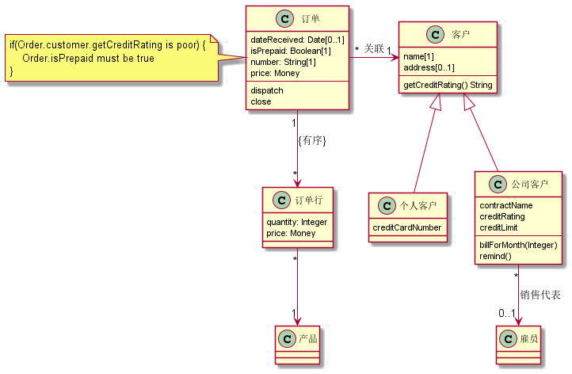

## 类图

1. 基础部分

一个类图表述系统中各个对象的类型及其存在的各种**静态关系**. 类图也明示类中的特性和操作以及用于对象连接方式的约束.UML使用特性(feature)一词作为涵盖类之特性与操作的一般术语.

**简单类图**



**特性**

特性是一个单一的概念, 但它出现了两种截然不同的表示中: **属性及关联**.

- 属性:

属性图示法把特性表述成类框中的一行正文. 属性的全形态:

**可见性  名:类型  重数=默认{特征串}**

```
名:String[1]="Untlitled"{readOnly}
```

可见性: 属性是否是公用(+)或私用(-)

属性名: 类如何指称属性.


2. 高级概念


